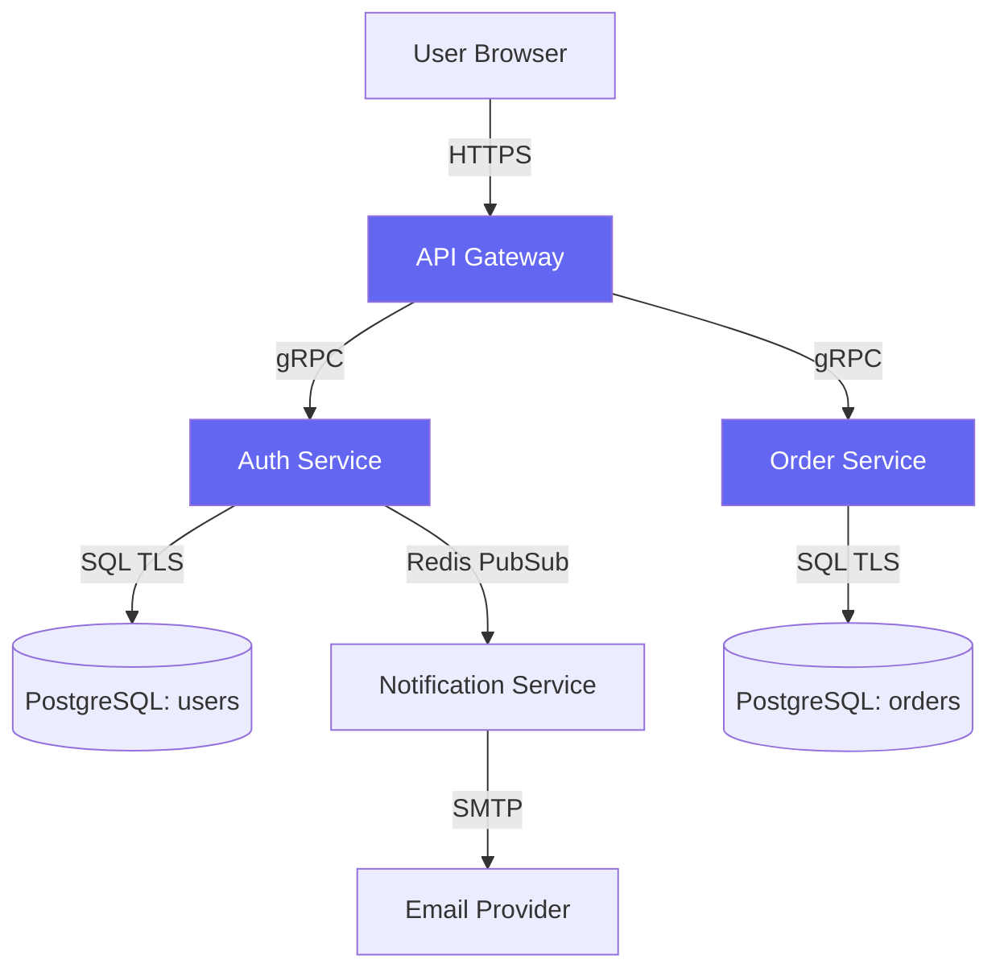

## What is a DFD?

A Data Flow Diagram (DFD) maps how data moves through your system. It is the foundational artefact for threat modelling — every threat is found by examining each component and each data flow in the diagram.

---

## DFD notation

| Symbol | Meaning | Example |
|---|---|---|
| Rectangle | **External entity** — outside your control | User browser, third-party API |
| Rounded rectangle / circle | **Process** — your code | Auth service, API gateway |
| Two parallel lines | **Data store** — persisted data | PostgreSQL, Redis, S3 bucket |
| Arrow | **Data flow** — data in motion | HTTPS request, gRPC call, queue message |
| Dashed line | **Trust boundary** — where privilege changes | Internet ↔ DMZ, DMZ ↔ internal network |

---

## Example DFD — Web application

```
[User Browser]
      |
      | HTTPS (JWT in Authorization header)
      |
[Load Balancer / WAF]  ·····trust boundary·····
      |
      | HTTP
      |
[API Gateway]
      |──────────────────────────────┐
      |                              |
      | gRPC                         | gRPC
      |                              |
[Auth Service]              [Order Service]
      |                              |
      | SQL (TLS)                    | SQL (TLS)
      |                              |
[PostgreSQL: users]      [PostgreSQL: orders]


[Auth Service] ──Redis PubSub──► [Notification Service]
                                          |
                                          | SMTP
                                          |
                                    [Email Provider]
                                    (External entity)
```

---

## Threat modelling from the DFD

For each element, ask the relevant STRIDE questions:

| DFD element | STRIDE categories to check |
|---|---|
| Every **data flow crossing a trust boundary** | Spoofing (who sent this?), Tampering (was it modified?), Info Disclosure (can it be read?) |
| Every **process** | All 6 STRIDE categories |
| Every **data store** | Tampering, Repudiation, Info Disclosure, DoS |
| Every **external entity** | Spoofing, Repudiation |

---

## Free DFD tools

| Tool | Notes | Link |
|---|---|---|
| OWASP Threat Dragon | DFD + STRIDE built in | threatdragon.com |
| draw.io / diagrams.net | Free, web-based, export to XML | diagrams.net |
| Excalidraw | Fast whiteboard-style DFDs | excalidraw.com |
| Mermaid | Code-based diagrams, renders in GitHub | mermaid.js.org |
| Lucidchart | Professional, free tier | lucidchart.com |

### DFD in Mermaid (renders in GitHub markdown)



<div class="references-section">

## 📚 Related pages

<div class="ref-grid">
  <a class="ref-card" href="/wiki/stride/">
    <span class="ref-label">Framework</span>STRIDE — Apply to your DFD
  </a>
  <a class="ref-card" href="/wiki/templates/threat-register/">
    <span class="ref-label">Template</span>Threat Register Template
  </a>
  <a class="ref-card" href="/wiki/tools/threat-dragon/">
    <span class="ref-label">Tool</span>OWASP Threat Dragon
  </a>
  <a class="ref-card" href="/posts/01-intro-to-threat-modelling/">
    <span class="ref-label">Post</span>Introduction to Threat Modelling
  </a>
  <a class="ref-card" href="/wiki/attack-trees/">
    <span class="ref-label">Wiki</span>Attack Trees
  </a>
</div>

</div>
